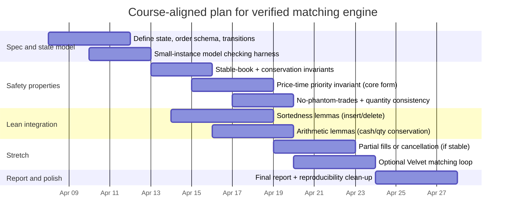

# Deep research analysis of a Veil proposal for a price-time-priority matching engine

## Executive summary

The proposal PDF describes a **formal-methods project**: specify a simplified electronic limit order book as a **transition system** and prove “exchange-like” **safety properties**—particularly **price-time priority (FIFO within price)**, **conservation of cash/assets**, and **trade provenance** (“no phantom trades”). fileciteturn0file0

This scope is intentionally narrower than a production-grade exchange matching engine. It models (at minimum) a **single asset**, **limit orders only**, and may omit or simplify **cancellation** and **partial fills** to control proof complexity and state-space growth. fileciteturn0file0 That difference matters: industry “matching engine” discussions usually optimize for **deterministic ultra-low latency**, **high throughput**, **fault tolerance**, and **regulatory-grade auditability**—and they must handle extensive order types, connectivity protocols, surveillance, and resilience obligations. citeturn10view0turn23view0turn3search2

A rigorous, actionable path that satisfies both (1) the proposal’s verification goals and (2) industry best practices is to treat the **Veil spec as the normative reference** and then (optionally) build an executable engine whose behavior is **refined from / cross-checked against** that spec:

- **Formal track (core deliverable):** write a clean Veil model + inductive invariants and use Veil’s automated invariant checking plus bounded model checking to iterate quickly on specification mistakes. citeturn19search0turn19search2turn1search3  
- **Executable track (high-leverage extension):** implement the matching loop in a “proof-aligned” way (e.g., Velvet) to enable **property-based testing** and **spec-to-code traceability** in the same Lean ecosystem. citeturn1search1turn1search10  
- **Industry mapping (if you extend beyond course scope):** keep the deterministic matching decision on a **single-threaded, ordered event stream**, and place concurrency at the edges (network I/O, persistence, risk checks) to preserve determinism and ease verification. This is consistent with well-known low-latency exchange architectures (event processor + append-only log) and with concurrency research on order books that emphasizes preserving sequential semantics. citeturn22search0turn7view0turn22search2

Key “production-grade” requirements that would materially alter architecture recommendations include: **kill-switch capability**, **pre-trade risk controls**, **real-time monitoring**, and **audit/surveillance replay** expectations (EU RTS6-like obligations) and **capacity/resiliency/BCDR** programs (US Regulation SCI-like obligations). citeturn23view0turn23view4turn10view0turn3search2

## Proposal specification and gap analysis

The proposal (author: entity["people","Chen Zhikun","cs project author 2026"]) defines the matching engine state as a transition system consisting of **two books** (buy side sorted by descending price; sell side sorted by ascending price), a **trade log**, and **per-account cash and asset holdings**; each order includes an ID, account, side, limit price, quantity, and timestamp. fileciteturn0file0

It targets safety properties that closely match “exchange correctness” expectations:

- **Stable book** (after matching, the book is not crossed). fileciteturn0file0  
- **Price-time priority** (consume best price first; FIFO within a price level). fileciteturn0file0  
- **Conservation** (total cash and total asset quantity preserved across steps). fileciteturn0file0  
- **No phantom trades** (each trade log entry traces back to two live orders). fileciteturn0file0  
- **Quantity consistency** (no trade uses more quantity than either side has remaining). fileciteturn0file0  

The tool plan is aligned with Veil’s design: model-check small instances early, then discharge main safety proofs with Veil’s invariant tooling (and Lean helper lemmas for arithmetic and ordered-data reasoning). fileciteturn0file0 This matches how Veil positions its workflow: multi-modal verification of transition systems, including automated invariant checking (e.g., `#check_invariants`) backed by SMT, plus model checking and interactive Lean proofs when automation is insufficient. citeturn19search0turn19search2turn1search3

Where “industry matching engine” expectations diverge (and would change recommendations if added):

- **Order types and priority overlays:** real venues often support many order attributes and may apply overlays or alternative allocation (e.g., pro-rata or customer-priority overlays). The entity["organization","Cboe Exchange, Inc.","options exchange operator US"] rulebook explicitly describes “Price-Time” priority and also “Pro-Rata” allocation and additional overlays; these complexities can invalidate simplistic FIFO assumptions if you later generalize the model. citeturn5view0turn5view2  
- **Replace/modify semantics:** real systems define when an order loses priority (e.g., price change or increasing quantity). The entity["organization","Australian Securities Exchange","securities exchange AU"] ASX Trade order-entry specification states that changing price or increasing quantity causes an order to lose priority. citeturn5view3turn4view3  
- **Connectivity and recovery:** exchange order-entry protocols often assume sequenced outbound messages and idempotent client resends for recovery; Nasdaq OUCH documents that host-to-client messages are sequenced (via lower level protocols) and that client-to-host messages are designed to be benignly resent after failures. citeturn21view0turn21view1  
- **Resilience and compliance:** regulatory regimes can impose explicit BCDR, capacity stress tests, monitoring, and audit/recordkeeping expectations. US Regulation SCI requires policies for capacity planning, stress tests, vulnerability reviews, and BCDR plans targeting next-business-day / two-hour resumption under wide-scale disruption. citeturn10view0turn3search16  
- **Fairness/market integrity controls:** in MiFID-like regimes, firms must have kill functionality, surveillance, business continuity arrangements, and pre-trade controls, among other governance measures. citeturn23view0turn23view4turn23view5  

If the PDF later expands scope (partial fills, cancellation, multiple assets), it will directly affect: the state-space size, which invariants are needed, and whether certain properties remain inductive without strengthening helper invariants. fileciteturn0file0turn19search2

## Background and related work

### Matching priority rules in real venues

A clean primary statement of price-time priority appears in the Cboe rulebook: resting orders at the best bid/offer have priority; at the same price, the system prioritizes in the order received (time priority). citeturn5view0 The same document shows that “matching rules” are not uniform across all markets or products: it also defines a pro-rata allocation mode and enumerates “priority overlays” (e.g., displayed over nondisplayed, customer overlays, AON last priority). citeturn5view0turn5view2

Many exchange connectivity specs also encode the assumption that a central limit order book matches in price-time priority. For example, Nasdaq’s OUCH 5.0 spec states that non-matching orders may be posted in the limit order book “where they wait to be matched in price-time priority.” citeturn21view1

Industry protocols define the operational semantics needed for determinism and auditability, including sequencing, unique identifiers, and recovery. Nasdaq OUCH assumes sequenced outbound messages (via a lower-layer sequencing protocol) and designs client-to-host messages so they can be benignly resent for robust recovery. citeturn21view0turn21view1 The entity["organization","New York Stock Exchange","securities exchange operator US"] Pillar Binary Gateway spec documents explicit failure recovery behaviors and primary/DR endpoints, including cancel-on-disconnect-like behavior and session restart consequences. citeturn21view3

These primary sources motivate an important modeling choice: **“price-time priority” is not just a sorting rule**; it is inseparable from *how* the system defines time ordering (timestamps vs arrival sequence numbers), what constitutes a priority-resetting modification, and how recovery/replay interacts with order identity.

### Formal verification of exchanges and matching algorithms

Academic work has directly argued that exchange software can violate published rules and that informal guidelines are often incomplete as program specifications. A formal-verification paper on trading in financial markets emphasizes that exchange matching algorithms are “the program” and regulatory/exchange rules are “broad specifications,” and highlights risks from inconsistent or incomplete informal guidelines. citeturn24view0

More directly aligned with your proposal’s property set, a formal approach to exchange design and regulation identifies **price-time priority**, **positive bid-ask spread**, and **conservation** as “natural properties” for continuous double auctions, argues they can determine a unique input-output relationship, and extracts a verified checker to detect violations by scanning trade logs. citeturn24view1 This is strongly conceptually compatible with the proposal’s “stable book,” “conservation,” and “no phantom trades” safety goals. fileciteturn0file0

### Tooling ecosystem for the proposal’s methodology

Veil is a framework for specifying and verifying transition systems; it supports automated inductive invariant checking (via an SMT-based `#check_invariants` workflow), along with model checking and interactive theorem proving in Lean when needed. citeturn19search0turn19search2turn1search3 The proposal’s plan—model-checking small instances to shake out specification bugs, then proving invariants—matches Veil’s intended usage. fileciteturn0file0turn19search2

Velvet is positioned as a multi-modal verifier embedded in Lean where programs can be executed, tested, and formally verified, which fits the proposal’s “optional verified matching loop” extension. citeturn1search1turn1search10

### Regulatory constraints that shape production architectures

If this work were extended from a course project to an exchange-like production system, regulatory texts become architectural requirements:

- US Regulation SCI requires policies and procedures for **capacity planning**, **stress testing**, **development/testing methodology**, **vulnerability testing (including disasters)**, **BCDR with geographic diversity**, and **monitoring**. citeturn10view0  
- MiFID II Article 48 requires venues to ensure resilience/capacity, orderly trading under stress, and includes controls like limiting order-to-trade ratios and slowing order flow if capacity is at risk. citeturn3search2  
- RTS6-style requirements (for algorithmic trading firms and in practice also mirrored by venues and participants) include **kill functionality**, **automated surveillance / replay**, **business continuity arrangements**, and **pre-trade controls**, all of which depend on rich, replayable event logs and deterministic processing. citeturn23view0turn23view3turn23view4turn23view5  

These sources don’t just add “extra modules”; they motivate engineering constraints like append-only audit logs, replayability, strict change management, and measurable recovery targets. citeturn10view0turn23view3

## Methods and architecture

This section provides two aligned architectures:

- A **verification-first architecture** consistent with your proposal.  
- A **production mapping** to show what would change under real-world demands (order types, protocols, concurrency, resilience).

image_group{"layout":"carousel","aspect_ratio":"16:9","query":["limit order book price time priority diagram","order book matching engine architecture gateway risk checks market data diagram","Nasdaq OUCH protocol message flow diagram","event sourcing architecture diagram trading system"],"num_per_query":1}

### Core matching semantics

**Price-time priority definition.** A canonical primary definition from Cboe: best bid/offer has priority; among same-price orders, earlier received has time priority. citeturn5view0 This is consistent with Nasdaq’s statement that its limit book matches in price-time priority. citeturn21view1

**Execution price rule.** The proposal notes it may fix a deterministic execution-price rule rather than model venue-specific conventions. fileciteturn0file0 In industry practice, execution price conventions can depend on aggressor/passive order, auction phases, or order attributes; changing the price rule can affect conservation proofs (cash transfers) and determinism of the trade log. citeturn24view1turn21view2

**Trade provenance and audit log.** Treat the trade log as a first-class artifact: formal work on exchange regulation emphasizes using a verified program/checker to detect violations by scanning trade logs. citeturn24view1 This suggests an actionable proof strategy: prove that every trade log entry is explainable by a valid match step over live orders—exactly the proposal’s “no phantom trades” goal. fileciteturn0file0

### State representation and data structures

A practical order-book representation decomposes into two layers:

1. **Price levels:** ordered map from price → FIFO queue of orders at that price.  
2. **Within-level FIFO:** time-priority queue (typically linked list / deque).

For performance-oriented literature, a concurrent order book study describes a baseline sequential algorithm where buy/sell orders are stored in separate heaps and same-price orders are aggregated in queues; matching iterates from the top of book. citeturn7view0 This maps cleanly to your formal model (buy-side / sell-side sorted books + FIFO within level). fileciteturn0file0

For verification, you want a representation that minimizes proof burden:

- **Relational/ranking relation encoding:** represent “priority” as a total order relation over live orders on each side, with invariants enforcing antisymmetry/transitivity and compatibility with (price, time). This can reduce reasoning about list insert/delete but increases relational proof obligations. This sits well with Veil’s relational-transition-system framing. citeturn1search3turn19search2  
- **Sorted sequence encoding:** represent each side as a sorted list/array of orders; you then prove insertion/deletion preserves sortedness (proposal explicitly anticipates Lean helper lemmas here). fileciteturn0file0  

A key industry nuance that impacts *both* proofs and implementations is modification semantics: ASX documentation says that changing price or increasing quantity causes an order to lose priority. citeturn5view3turn4view3 If your model later adds “modify,” you must bake priority-reset rules into the state machine; otherwise “price-time priority” is underspecified.

### Concurrency and determinism

Your proposal is for a centralized sequential system, but it still benefits from treating inputs as an interleaving of actions (submit/match/cancel). fileciteturn0file0turn1search3

For a production mapping, keep the **matching decision** single-threaded per symbol (or per shard of symbols) to retain determinism and simplify verification. This is consistent with the entity["company","LMAX Exchange","financial trading venue UK"] architecture described by entity["people","Martin Fowler","software engineer author"]: a single-threaded business logic processor runs in-memory and uses event sourcing, surrounded by Disruptor queues for concurrency without lock contention. citeturn22search0turn2search0turn22search2

Concurrency research on order books highlights why this separation is helpful: to preserve the same output as sequential processing, they process requests in the same received sequence, assign monotonically increasing timestamps, and then explore concurrency strategies that trade consistency guarantees for throughput. citeturn7view0 This directly supports a design recommendation: when the correctness property is **queue discipline**, push concurrency to the edges and keep a serialized core.

### Latency optimization and networking stack choices

These topics are largely outside the proposal’s proof scope, but they matter if you build an executable benchmarked engine.

Exchange protocols and market infrastructure docs signal typical low-latency approaches:

- **Fixed-size binary protocols:** OUCH messages are fixed length; iLink 3 highlights fixed positions and fixed-length fields with SBE and a lightweight session layer (FIXP) for efficiency. citeturn21view0turn21view4  
- **Sequencing + replay/recovery:** OUCH requires sequenced outbound delivery and supports benign resends for recovery; NYSE Pillar documents primary/DR and explicit failure recovery behavior. citeturn21view0turn21view3  
- **Kernel-bypass / poll-mode I/O:** DPDK documentation describes poll-mode drivers that access NIC descriptors directly without interrupts and run an endless polling loop on dedicated cores. citeturn9search0  

For timestamping and synchronized clocks in benchmarks or audit trails, the relevant primary standards are:

- entity["organization","Internet Engineering Task Force","internet standards body"] RFC 5905 specifies the Network Time Protocol v4 on-wire timestamp model. citeturn8search2  
- entity["organization","IEEE","standards organization"] IEEE 1588 defines the Precision Time Protocol for accurate clock synchronization in networked systems. citeturn8search3  

### Fault tolerance, persistence, and recovery

Even if the proposal’s formal model does not include persistence, production-grade architectures treat persistence as inseparable from correctness and compliance. US Regulation SCI explicitly requires BCDR plans with backup/recovery capabilities and geographic diversity, plus routine testing. citeturn10view0 EU RTS6-style texts require business continuity arrangements and yearly review/testing, and kill functionality to cancel unexecuted orders. citeturn23view0turn23view4

A practical, correctness-friendly persistence pattern is **event sourcing**, where every state change is recorded as an event in sequence and state is reconstructible by replay. citeturn22search2 This aligns strongly with “trade log correctness” and post-incident replay requirements (e.g., surveillance replay capacity expectations). citeturn23view3

### Security and access controls

In production, “security” for matching engines is not optional; it is embedded in resilience obligations:

- Regulation SCI requires vulnerability reviews/testing for internal/external threats and systems intrusion response processes, plus monitoring for potential events. citeturn10view0  
- RTS6 includes surveillance and monitoring expectations and prescribes governance/controls; it specifies automated surveillance with replay and alerting expectations. citeturn23view3turn23view6  

## Experiments and benchmarks

This section proposes two experiment layers:

- **Verification experiments** (what matters for the proposal).  
- **Performance experiments** (what you asked for; relevant if you build an executable engine).

### Verification-first test plan

Veil’s workflow explicitly supports:
- automated invariant checking (`#check_invariants`) with counterexamples to induction (CTIs) when invariants fail, citeturn19search2  
- model checking plus human-guided refinement. citeturn1search0turn19search3  

A concrete verification experiment matrix that is actionable and measurable:

| Experiment | Goal | Variables to sweep | Metrics | Passing criteria |
|---|---|---|---|---|
| Bounded model checking smoke suite | Find spec bugs early | #accounts, max #orders, bounded prices/qty | Time to find counterexample; max explored states; memory | No counterexample for bounded sizes |
| Inductive invariant checking | Prove safety properties | Add/remove candidate invariants | SMT time; CTI count; proof stability | `#check_invariants` passes for core invariants |
| “Refinement” check for matching loop (if using Velvet) | Tie executable loop to spec postcondition | Loop invariants strength; partial fill support | Proof obligations; runtime of test harness | Loop postcondition implies Veil match step |

These experiments are aligned with the proposal’s explicit plan: model check small instances early and then prove invariants, using Lean helper lemmas for sortedness and arithmetic where needed. fileciteturn0file0turn19search2

### Synthetic workloads for functional and performance benchmarking

For an executable prototype (even if not required by the proposal), you can reuse a well-studied synthetic workload approach:

A concurrent order book paper contributes a workload generator noting that real datasets are hard to share and that synthetic generation is needed; it implements a variation of the Maslov model and extends it to incorporate arbitrary volumes to exercise partial fills. citeturn7view0 This provides a credible blueprint for “exchange-like” stress tests without proprietary data:

- Order arrivals: mix of market/limit (if you include market orders). citeturn7view0  
- Prices: generated around opposite best price with bounded random offsets. citeturn7view0  
- Sizes: power-law / heavy-tailed to reflect partial fill behavior. citeturn7view0  

That paper also reports an evaluation methodology: replay 100,000 offline-generated orders, vary thread counts, run multiple trials, and compare speedups. citeturn7view0 You can adapt the structure even if you keep the matching core single-threaded (vary symbols/shards rather than internal threads).

### Benchmark metrics and measurement hygiene

The report format you requested—latency percentiles, throughput, depth, fairness, determinism—can be made precise:

- **Latency percentiles:** p50/p90/p99/p99.9 for (a) order acceptance ack, (b) match-to-execution report, (c) end-to-end gateway→engine→publish. Exchange protocols emphasize low-overhead fixed formats, so measure serialization/deserialization separately from matching time. citeturn21view0turn21view4  
- **Throughput:** messages/s and trades/s at steady state and burst. Regulation SCI requires periodic capacity stress tests for timely processing. citeturn10view0  
- **Order book depth:** distribution of levels and queue lengths; track top-of-book stability and spread (stable-book property corresponds to positive spread / no crossing). citeturn24view1turn7view0  
- **Fairness:** for price-time engines, verify FIFO at-level: later orders at same price should not receive fills before earlier orders, matching the rulebook statement. citeturn5view0  
- **Determinism:** replay identical input event streams and assert identical trade logs and final books (hash-compare). Deterministic replay is also central to surveillance replay requirements. citeturn23view3turn22search2  

Measurement pitfalls: load generators often miss tail latency via coordinated omission; coordinated omission has been widely discussed in the latency-measurement community, and HDR histograms are a common approach for capturing long-tail behavior efficiently. citeturn8search4turn8search1

### Benchmark reporting templates

**Template chart** (illustrative only; replace with measured data):

```mermaid
xychart-beta
  title "Template: Matching latency percentiles vs SLA (illustrative)"
  x-axis ["p50","p90","p99","p99.9"]
  y-axis "microseconds" 0 --> 200
  bar ["measured (fill later)"] [20, 35, 80, 150]
  line ["SLA target"] [25, 50, 100, 180]
```

**Benchmark suite table**

| Suite | Workload | Primary focus | Key outputs |
|---|---|---|---|
| Functional determinism | Fixed scripted scenarios + random seeds | Repeatability | Same trades + same final book hash |
| FIFO fairness | Many orders at identical price levels | Queue discipline | No FIFO violations; violation trace |
| Depth stress | Wide price ladder + heavy-tailed sizes | Depth handling | Depth percentiles; match cost vs depth |
| Burst resilience | Microbursts 10× baseline | Tail latency | p99.9 latency, drop/timeout rates |
| Recovery replay | Crash mid-stream + restart from log | Correct recovery | No duplicate trades; consistent reconstruction |

These are operationalizable even in a “course scope” prototype by using a single-threaded core and a harness that replays deterministic event traces. citeturn22search2turn21view0turn21view3

## Implementation roadmap and resource estimates

This roadmap is split into:

- a **course-aligned plan** consistent with the proposal (ending April 27, 2026), fileciteturn0file0  
- an **industry extension plan** (if you continue beyond the course).

### Course-aligned roadmap

The proposal already includes a schedule and deliverables (Veil spec, at least one safety theorem, model checking, Lean lemmas, report). fileciteturn0file0 The following adds “actionable engineering detail” while staying within that envelope.



This preserves the proposal’s risk-management plan: if state explosion occurs, tighten bounds or prove a weaker local property (“each match step picks current best bid and ask”) and model-check stronger properties on bounded instances. fileciteturn0file0turn19search2

### Industry extension roadmap

If you extend:

1. **Spec hardening:** add explicit definitions for modify/replace priority loss (as ASX describes) and formalize cancellation and partial fills (these are common and materially affect invariants). citeturn5view3turn7view0  
2. **Protocol-aware modeling:** include message sequencing, idempotent resend behavior, and recovery constraints (as OUCH documents). citeturn21view0turn21view1  
3. **Resilience/compliance layer:** implement kill switch, replayable audit store, and BCDR targets aligned to Regulation SCI-like controls and RTS6-like monitoring expectations. citeturn10view0turn23view0turn23view3  

A realistic “first production-like prototype” horizon is ~10–16 weeks for a small team, largely because compliance-grade testing, replay/auditability, and deployment controls dominate engineering time once matching correctness is stable. citeturn10view0turn23view4

### Team roles

For the course project (solo), roles can be “hats” you wear. For an extended build, the minimum effective set typically includes:

- Formal methods engineer (Veil + Lean invariants; proof refactoring when state grows). citeturn19search0turn19search2  
- Matching engine engineer (data structures, determinism, correctness harness). citeturn7view0turn5view0  
- Infrastructure/SRE (CI, benchmark harness, monitoring, recovery drills aligned to Regulation SCI-like expectations). citeturn10view0  
- Security/compliance (controls, change management, incident procedures; surveillance monitoring expectations). citeturn10view0turn23view3  

### Hardware and cloud choices with rough cost anchors

For the proposal’s verification work, commodity development hardware is sufficient; performance and kernel-bypass choices mainly matter if you benchmark an executable low-latency engine.

If you do benchmark in cloud, ensure reproducibility constraints (pinned CPU, isolated cores, stable clocks) because tail latency is sensitive to noisy neighbors; DPDK-style dedicated polling loops can be a reference point for “dedicated core” design. citeturn9search0

Approximate on-demand pricing anchors (region/discounts vary; treat as planning placeholders):

- AWS EC2 c7i.4xlarge listed around $0.714/hr in us‑east‑1 on third-party trackers. citeturn17search2turn17search10  
- AWS EC2 c7gn.4xlarge listed around $0.9984/hr in us‑east‑1. citeturn17search0turn17search12  
- AWS EC2 i4i.4xlarge listed around $1.373/hr in us‑east‑1. citeturn17search1turn17search9  

Practical note: dedicated bare-metal services can change availability (e.g., sunset announcements); verify provider lifecycle before committing to a benchmark platform. citeturn17search14

### CI/CD, monitoring, deployment, rollback

**For the verified spec (course scope):**

- CI on every commit: run Lean build, `#check_invariants`, and bounded model-checking suites; fail-fast on CTIs. citeturn19search2turn19search0  
- Artifact discipline: version lock Veil/Lean toolchain; archive model-check bounds and seeds to reproduce counterexamples. citeturn19search2  

**For a production-like extension:**

- Monitoring: Regulation SCI explicitly requires system monitoring to identify potential events; design metrics and alerting as first-class. citeturn10view0  
- Rollback: NYSE Pillar documentation discusses session restarts and consequences; use this mindset to define deterministic rollback semantics and cancel-on-disconnect behavior in your own system. citeturn21view3  
- Emergency controls: RTS6 specifies kill functionality to cancel unexecuted orders; implement a “kill path” that is reliable, fast, and audited. citeturn23view0turn23view4  

### Actionable step-by-step implementation checklist

This checklist is structured so that each step produces a verifiable artifact (spec, invariant, test, or measurement output).

1. Write a precise order schema: ID, side, limit price, timestamp/sequence, qty, account. fileciteturn0file0  
2. Define a canonical notion of “time priority”: arrival sequence vs timestamp; specify tie-breaking. citeturn5view0turn21view0  
3. Choose execution price rule and make it explicit (even if simplified). fileciteturn0file0  
4. Encode buy/sell books as either (a) sorted sequences or (b) ranking relations; decide based on proof effort. fileciteturn0file0turn1search3  
5. Specify transitions: submit, match; add cancel/partial fills only once the base proof is stable. fileciteturn0file0  
6. Add invariants for book well-formedness (no duplicate IDs; side consistency; nonnegative remaining qty). fileciteturn0file0  
7. Add “stable book” invariant (no crossing after match completes). fileciteturn0file0turn24view1  
8. Formalize price-time priority invariant for each match step (“best bid/ask chosen; FIFO within level”). fileciteturn0file0turn5view0  
9. Add conservation invariants over cash/assets + trade log accounting. fileciteturn0file0turn24view1  
10. Add trade provenance invariants (each trade references two prior-live orders). fileciteturn0file0  
11. Run bounded model checking at tiny bounds; treat every counterexample as either a spec bug or a missing invariant. citeturn19search2turn1search0  
12. Use `#check_invariants`; iterate until CTIs disappear for core invariants. citeturn19search2turn19search0  
13. Create Lean helper lemmas for sortedness insert/delete if you chose sorted list encodings. fileciteturn0file0  
14. Create Lean lemmas for arithmetic (qty decrement, conservation sums, nonnegativity). fileciteturn0file0  
15. Freeze a “verified core” tag; only then attempt partial fills or cancellation. fileciteturn0file0  
16. If adding cancellation, specify modify semantics and priority loss rules (e.g., price change loses priority). citeturn5view3turn4view3  
17. If building an executable loop, implement matching in Velvet and connect postconditions to the Veil spec. citeturn1search1turn1search10  
18. Add property-based tests that generate random event streams and compare to the spec/extracted reference. citeturn1search1turn22search2  
19. Define benchmark harness input format as an append-only event log to enable deterministic replay. citeturn22search2turn23view3  
20. For performance runs, record latency with HDR histograms and avoid coordinated omission in the load generator. citeturn8search4turn8search1  
21. If you add networking, adopt explicit sequence numbers and idempotent resend semantics as protocols like OUCH assume. citeturn21view0turn21view1  
22. Add a kill-switch path (even if stubbed) and make it auditable; this mirrors RTS6-style expectations. citeturn23view0turn23view4  
23. Add recovery tests (crash mid-stream + replay); verify no duplicate executions and identical final hashes. citeturn22search2turn21view3  
24. Document scope explicitly: which order types/overlays are excluded, and why; real venues often have overlays and alternate allocation rules. citeturn5view2turn5view0  
25. Produce the final report with a reproducibility appendix (bounds, seeds, toolchain versions). fileciteturn0file0turn19search2  

## Risks and compliance

### Risk register with mitigations

**State-space explosion (verification).** The proposal identifies state growth as the central risk and plans bounded model checking plus deductive fallback properties. fileciteturn0file0turn19search2  
Mitigation: treat “minimal verified core” as success; tighten bounds; prove local step properties + bounded global properties.

**Underspecified semantics (price rule, modify priority, timestamps).** Exchange and regulatory rules are often incomplete as program specs; formal trading work highlights this gap and the risk of inconsistent guidelines. citeturn24view0turn24view1  
Mitigation: write explicit semantics for time priority, replace/modify behavior, and execution price rule; keep them in the spec, not in prose.

**Mismatch to venue practice.** Real venues have overlays and alternate allocation rules; Cboe documents non-price-time modes and priority overlays. citeturn5view0turn5view2  
Mitigation: document “assumed market model” precisely and isolate where additional rules would slot into the state machine.

**Determinism risk under concurrency.** Concurrency research on order books stresses preserving sequential semantics; careless parallelism can violate queue discipline. citeturn7view0  
Mitigation: keep a serialized matching core, parallelize only I/O and independent symbols/shards.

**Operational resilience and incident response (production extension).** Regulation SCI imposes explicit recovery expectations and requires BCDR testing and monitoring; RTS6-style texts include kill-switch and surveillance replay expectations. citeturn10view0turn23view0turn23view3  
Mitigation: event-sourced logs + deterministic replay; routine recovery drills; auditable emergency controls.

### Compliance mapping highlights

If you ever position the work as exchange-like infrastructure, the following requirements become “non-negotiable design constraints”:

- **Capacity planning & stress testing:** explicitly required for SCI entities. citeturn10view0  
- **BCDR with recovery targets:** SCI requires geographically diverse backup/recovery and resumption objectives. citeturn10view0  
- **Order flow controls:** MiFID II Article 48 includes slowing order flow when capacity is at risk and managing order-to-trade ratios. citeturn3search2  
- **Kill functionality & surveillance replay:** RTS6 includes kill switch language and mandates surveillance systems with replay capability and adequate time granularity. citeturn23view0turn23view3  

These map cleanly to architectural components: append-only event log, deterministic replay engine, real-time monitoring/alerting, and a privileged emergency-control plane.

## Primary sources and further reading

Exchange rules and protocols (priority, sequencing, recovery):
- entity["organization","Cboe Exchange, Inc.","options exchange operator US"] rulebook (price-time priority, pro-rata, overlays). citeturn5view0turn5view2  
- entity["organization","The Nasdaq Stock Market","securities exchange operator US"] OUCH 4.2 / 5.0 specs (price-time, sequencing, resend/recovery). citeturn21view0turn21view1  
- entity["organization","The Nasdaq Stock Market","securities exchange operator US"] TotalView-ITCH spec (order life-cycle messages; full depth). citeturn21view2  
- entity["organization","New York Stock Exchange","securities exchange operator US"] Pillar Binary Gateway spec (failure recovery; primary/DR; identifiers). citeturn21view3  
- entity["organization","CME Group","derivatives exchange operator US"] iLink 3 session guidance (SBE, FIXP, fixed-length efficiency). citeturn21view4turn20search7  
- entity["organization","Australian Securities Exchange","securities exchange AU"] ASX Trade FIX order entry spec (priority loss on modify). citeturn5view3turn4view3  

Regulation and standards (resilience, monitoring, time):
- entity["organization","U.S. Securities and Exchange Commission","securities regulator US"] Regulation SCI (capacity tests, BCDR, monitoring, change controls). citeturn10view0turn3search16  
- entity["organization","European Securities and Markets Authority","EU securities regulator"] MiFID II Article 48 (venue resilience controls). citeturn3search2  
- EU RTS6 draft (kill functionality; surveillance replay; BCDR; pre-trade controls). citeturn23view0turn23view3turn23view4turn23view5  
- entity["organization","Internet Engineering Task Force","internet standards body"] RFC 5905 (NTPv4). citeturn8search2  
- entity["organization","IEEE","standards organization"] IEEE 1588 (PTP). citeturn8search3  

Formal verification and concurrency research:
- Veil transition-system verification and automated invariant checking (`#check_invariants`). citeturn19search0turn19search2turn1search3  
- Velvet multi-modal verification (execute + test + prove). citeturn1search1turn1search10  
- Formal exchange design/regulation using price-time priority + conservation + positive spread; verified checker from trade logs. citeturn24view1  
- Concurrency strategies for order books + synthetic workload generation; emphasis on preserving sequential semantics. citeturn7view0  

Performance architecture references:
- Single-thread event processor + event sourcing for low latency (LMAX architecture). citeturn22search0turn22search2  
- DPDK poll-mode, userspace packet processing loop. citeturn9search0  
- HDR histogram for fixed-footprint latency percentiles; coordinated omission caution. citeturn8search4turn8search1